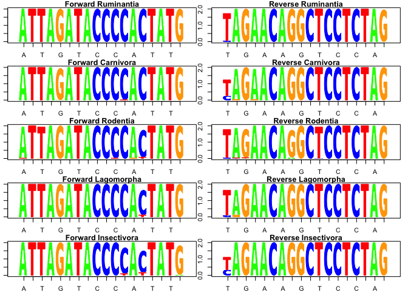
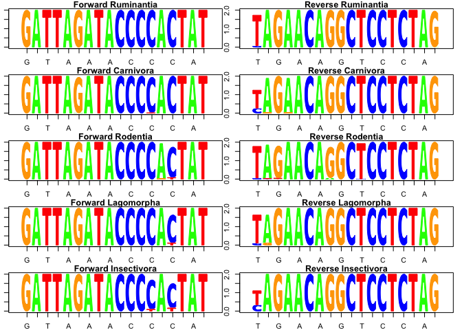

Design DNA Metabarcode to Analyze Wolf Diet
================
Yue Shi, PhD candidate, University of Washington,
4/27/2018

-   [Preparation](#preparation)
    -   [Computer Environment](#computer-environment)
        -   [Installation Order of OBITools and Related Programs](#installation-order-of-obitools-and-related-programs)
    -   [Data from NCBI](#data-from-ncbi)
    -   [Reformatting](#reformatting)
-   [Step One: Annotate sequences by their sepcies `taxid`, and keep a single genome per species](#step-one-annotate-sequences-by-their-sepcies-taxid-and-keep-a-single-genome-per-species)
-   [Step Two: Selection of the vertebrata genomes](#step-two-selection-of-the-vertebrata-genomes)
-   [Step Three: Selecting the best primer pairs with ecoPrimers and ecoPCR.](#step-three-selecting-the-best-primer-pairs-with-ecoprimers-and-ecopcr.)
-   [Step Four: Test primer pairs with `ecoPCR`](#step-four-test-primer-pairs-with-ecopcr)
    -   [Switch from Unix to R](#switch-from-unix-to-r)
    -   [*in silico* primer check](#in-silico-primer-check)
        -   [Primer Pair No.01 AAACTGGGATTAGATACC TAGAACAGGCTCCTCTAG](#primer-pair-no.01-aaactgggattagatacc-tagaacaggctcctctag)
            -   [Conservation of the priming sites](#conservation-of-the-priming-sites)
            -   [Influence of mismatches on taxonomical selection](#influence-of-mismatches-on-taxonomical-selection)
            -   [Taxonomic resolution](#taxonomic-resolution)
            -   [Primer melting temperature](#primer-melting-temperature)
        -   [Primer Pair No.02 AACTGGGATTAGATACCC TAGAACAGGCTCCTCTAG](#primer-pair-no.02-aactgggattagataccc-tagaacaggctcctctag)
            -   [Conservation of the priming sites](#conservation-of-the-priming-sites-1)
            -   [Influence of mismatches on taxonomical selection](#influence-of-mismatches-on-taxonomical-selection-1)
            -   [Taxonomic resolution](#taxonomic-resolution-1)
            -   [Primer melting temperature](#primer-melting-temperature-1)
        -   [Primer Pair No.03 CAAACTGGGATTAGATAC TAGAACAGGCTCCTCTAG](#primer-pair-no.03-caaactgggattagatac-tagaacaggctcctctag)
            -   [Conservation of the priming sites](#conservation-of-the-priming-sites-2)
            -   [Influence of mismatches on taxonomical selection](#influence-of-mismatches-on-taxonomical-selection-2)
            -   [Taxonomic resolution](#taxonomic-resolution-2)
            -   [Primer melting temperature](#primer-melting-temperature-2)
        -   [Primer Pair No.04 ATTAGATACCCCACTATG TAGAACAGGCTCCTCTAG](#primer-pair-no.04-attagataccccactatg-tagaacaggctcctctag)
            -   [Conservation of the priming sites](#conservation-of-the-priming-sites-3)
            -   [Influence of mismatches on taxonomical selection](#influence-of-mismatches-on-taxonomical-selection-3)
            -   [Taxonomic resolution](#taxonomic-resolution-3)
            -   [Primer melting temperature](#primer-melting-temperature-3)
        -   [Primer Pair No.05 GATTAGATACCCCACTAT TAGAACAGGCTCCTCTAG](#primer-pair-no.05-gattagataccccactat-tagaacaggctcctctag)
            -   [Conservation of the priming sites](#conservation-of-the-priming-sites-4)
            -   [Influence of mismatches on taxonomical selection](#influence-of-mismatches-on-taxonomical-selection-4)
            -   [Taxonomic resolution](#taxonomic-resolution-4)
            -   [Primer melting temperature](#primer-melting-temperature-4)
        -   [Primer Pair No.06 ACTGGGATTAGATACCCC TAGAACAGGCTCCTCTAG](#primer-pair-no.06-actgggattagatacccc-tagaacaggctcctctag)
            -   [Conservation of the priming sites](#conservation-of-the-priming-sites-5)
            -   [Influence of mismatches on taxonomical selection](#influence-of-mismatches-on-taxonomical-selection-5)
            -   [Taxonomic resolution](#taxonomic-resolution-5)
            -   [Primer melting temperature](#primer-melting-temperature-5)
        -   [Primer Pair No.07 GGGATTAGATACCCCACT TAGAACAGGCTCCTCTAG](#primer-pair-no.07-gggattagataccccact-tagaacaggctcctctag)
            -   [Conservation of the priming sites](#conservation-of-the-priming-sites-6)
            -   [Influence of mismatches on taxonomical selection](#influence-of-mismatches-on-taxonomical-selection-6)
            -   [Taxonomic resolution](#taxonomic-resolution-6)
            -   [Primer melting temperature](#primer-melting-temperature-6)
        -   [Primer Pair No.Riaz TTAGATACCCCACTATGC TAGAACAGGCTCCTCTAG](#primer-pair-no.riaz-ttagataccccactatgc-tagaacaggctcctctag)
            -   [Conservation of the priming sites](#conservation-of-the-priming-sites-7)
            -   [Influence of mismatches on taxonomical selection](#influence-of-mismatches-on-taxonomical-selection-7)
            -   [Taxonomic resolution](#taxonomic-resolution-7)
            -   [Primer melting temperature](#primer-melting-temperature-7)
-   [Conclusion](#conclusion)

Preparation
-----------

### Computer Environment

-   A Unix computer: a Mac or a Linux box
-   A Unix terminal window
-   Install the followings on the computer via command line interface.
    -   [OBITools](http://metabarcoding.org/obitools)
    -   [ecoPCR](http://metabarcoding.org/ecopcr)
    -   [ecoPrimers](http://metabarcoding.org/ecoprimers)

##### Installation Order of OBITools and Related Programs

-   **Install Anaconda 2**. Anaconda is a free and open source distribution of Python, which aims to simplify package management and deployment. Package versions are managed by the package management system conda, which makes it quite simple to install, run and update complex data science and machine learning software libraries. Anaconda 2 contains Python 2.7 and over 150 scientific packages, whereas Anaconda 3 contains Python 3. OBITools uses Python 2.7, therefore Anaconda 2 should be installed.
-   **Install pip** in case you don't have it. The pip command is a tool for installing and managing Python packages, such as those found in the Python Package Index. *sudo* allows authorized users (normally “Administrative” users) to run certain programs as Root without having to know the root password.

        sudo apt-get install python-pip

-   **Install biopython dependencies**. Biopython is a set of freely available tools for biological computation written in Python by an international team of developers.

        sudo pip install biopython

-   **Install OBITools**. It will automatically install virtualenv, cython and sphnx. Probablly you will get some warnings and "compiling errors". But the OBITools will still work. To see if OBITools have been properly installed, use help. If you get the help screen of the command, then everything is working OK.

        sudo pip install obitools
        obicount --help

-   **Install Homebrew**. Homebrew installs Setuptools and pip for you. Setuptools enables you to download and install any compliant Python software over a network (usually the Internet) with a single command ( easy\_install ). It also enables you to add this network installation capability to your own Python software with very little work.

        ruby -e "$(curl -fsSL https://raw.githubusercontent.com/Homebrew/install/master/install)"

-   **Install wget**. Wget is a free utility that can be used for retrieving files using HTTP, HTTPS, and FTP which are considered as the most widely-used Internet protocols. Its name comes from World Wide Web + get.

        brew install wget --with-libressl

-   **Install ecoPCR**. ecoPCR is an electronic PCR software which helps you estimate Barcode primers quality, compute barcode coverage and barcode specificity. Print the help screen to check if ecoPCR is installed succesfully.

        tar -zxvf ecopcr-*.tar.gz
        cd ecoPCR/src/
        make
        ./ecoPCR -h

-   **Install ecoPrimers**. ecoPrimers is a software that find primers from a set of sequences. This software is developed by using a more formal approach to qualify a barcode region and a new way for identifying barcode loci without a pirori on the candidate sequences. Print out the help screen to check if ecoPrimers is installed succesfully.

        tar –zxvf ecoPrimers.tar.gz
        cd ecoPrimers/src/
        make
        ./ecoPrimers -h

Note: to make it easy, move the folders `ecoPCR` and `ecoPrimers` into your data file, in my case, my data file `Primers` (where all the mitochondrial genomes and taxonomy IDs are stored).

### Data from NCBI

-   Download the complete set of whole mitochondrial genomes into the directory called "mitochondria". Note that MITOCHONDRIA was archived. You are about to download the mitochondrial genomes from 7681 species and you don't have to click 7681 times! But it will take a while. Make sure the internet connection is good through out the period. I started downloading before I went to bed, and when I woke up, there were there in the folder of *mitochondria*.

        mkdir mitochondria 
        cd mitochondria
        wget 'ftp://ftp.ncbi.nlm.nih.gov/genomes/archive/old_refseq/MITOCHONDRIA/Metazoa/*.gbk'
        cd ..

-   Download the NCBI taxonomy, which contains all the relationship between taxa. Each taxon is identified by a unique numerical id: `taxid`. You can check the content of files, e.g. show the first 6 lines of the file. Then reformat it according to the OBITools format.

        mkdir ncbitaxon
        cd ncbitaxon/
        wget 'ftp://ftp.ncbi.nlm.nih.gov://pub/taxonomy/taxdump.tar.gz'
        tar -xf taxdump.tar.gz
        head -6 nodes.dmp
        cd ..

### Reformatting

-   Reformat the taxonomy to the OBITools format. After running the following command, four files are created, ncbitaxon.adx, ncbitaxon.ndx, ncbitaxon.rdx, ncbitaxon.tdx. These are reformated taxonomy.

<!-- -->

    obitaxonomy -t ncbitaxon -d ncbitaxon

``` bash
ls
```

    ## WolfDietMetabarcoding.Rproj
    ## amniota.ecoprimers
    ## ecoPCR
    ## ecoPrimers
    ## mito.all.fasta
    ## mito.one.fasta
    ## mito.vert.adx
    ## mito.vert.fasta
    ## mito.vert.ndx
    ## mito.vert.rdx
    ## mito.vert.tdx
    ## mito.vert_001.sdx
    ## ncbitaxon
    ## ncbitaxon.adx
    ## ncbitaxon.ndx
    ## ncbitaxon.rdx
    ## ncbitaxon.tdx
    ## readme.md
    ## vert.01.ecopcr
    ## vert.02.ecopcr
    ## vert.03.ecopcr
    ## vert.04.ecopcr
    ## vert.05.ecopcr
    ## vert.06.ecopcr
    ## vert.07.ecopcr
    ## vert.Riaz.ecopcr
    ## vertebrata.ecoprimers
    ## wolf.md
    ## wolf.rmd
    ## wolf_cache
    ## wolf_files
    ## wolfhtml.html
    ## wolfhtml.rmd

As you can tell, there are four new files generated, .adx, .ndx, .rdx and .tdx.

-   Merge and convert all genomes into a single fasta file

<!-- -->

    obiconvert mitochondria/*.gbk > mito.all.fasta

A new file called "mito.all.fasta" is generated which contains complete mitochondrial genomes from all the species.

``` bash
head -5 mito.all.fasta
```

    ## >AC_000022 organism=Rattus norvegicus; taxid=10116; Rattus norvegicus strain Wistar mitochondrion, complete genome
    ## gttaatgtagcttataataaagcaaagcactgaaaatgcttagatggattcaaaaatccc
    ## ataaacacaaaggtttggtcctggccttataattaattggaggtaagattacacatgcaa
    ## acatccataaaccggtgtaaaatcccttaaagatttgcctaaaacttaaggagagggcat
    ## caagcacataatatagctcaagacgccttgcctagccacacccccacgggactcagcagt

Step One: Annotate sequences by their sepcies `taxid`, and keep a single genome per species
-------------------------------------------------------------------------------------------

Note: obiannotate command adds/edits sequence record annotations.

    obiannotate -d ncbitaxon --with-taxon-at-rank=species mito.all.fasta |
    obiannotate -S 'ori_taxid=taxid' |
    obiannotate -S 'taxid=species' |
    obiuniq -c taxid |
    obiselect -c taxid -n 1 -f count -M > mito.one.fasta
    obicount mito.all.fasta
    obicount mito.one.fasta

In `mito.all.fasta`, there are 5669 genomes, whereas in `mito.one.fasta`, there are 5651 genomes. It shows there are multiple complete mitochondrial genomes for certain species.

Step Two: Selection of the vertebrata genomes
---------------------------------------------

Selection is done with taxid, so first we will need to find the taxid for the phylum vertebrata.

``` bash
ecoPCR/src/ecofind -d ncbitaxon '^vertebrata$'
```

    ## Reading 1739138 taxa...
    ## No local taxon
    ## # 
    ## #  opening ncbitaxon database
    ## #  1739138 taxons
    ## #
    ## #  searching for '^vertebrata$' pattern
    ## #  taxonomy id   |   taxonomy rank   |    name                                                   |    class name         |    scientific name
    ## #
    ##       7742   |         no rank   |    Vertebrata                                             |    scientific name    |    Vertebrata
    ##    1261581   |           genus   |    Vertebrata                                             |    scientific name    |    Vertebrata
    ## #  2 records found

So there are two records called "vertebrata". In fact, there is a genus called vertebrata. Which one is what we want?

``` bash
ecoPCR/src/ecofind -d ncbitaxon -p 7742 
ecoPCR/src/ecofind -d ncbitaxon -p 1261581
```

    ## Reading 1739138 taxa...
    ## No local taxon
    ## # 
    ## #  opening ncbitaxon database
    ## #  taxonomy id   |   taxonomy rank   |    name                                                   |    class name         |    scientific name
    ## #
    ##       7742   |         no rank   |    Vertebrata                                             |    scientific name    |    Vertebrata
    ##      89593   |       subphylum   |    Craniata                                               |    scientific name    |    Craniata
    ##       7711   |          phylum   |    Chordata                                               |    scientific name    |    Chordata
    ##      33511   |         no rank   |    Deuterostomia                                          |    scientific name    |    Deuterostomia
    ##      33213   |         no rank   |    Bilateria                                              |    scientific name    |    Bilateria
    ##       6072   |         no rank   |    Eumetazoa                                              |    scientific name    |    Eumetazoa
    ##      33208   |         kingdom   |    Metazoa                                                |    scientific name    |    Metazoa
    ##      33154   |         no rank   |    Opisthokonta                                           |    scientific name    |    Opisthokonta
    ##       2759   |    superkingdom   |    Eukaryota                                              |    scientific name    |    Eukaryota
    ##     131567   |         no rank   |    cellular organisms                                     |    scientific name    |    cellular organisms
    ##          1   |         no rank   |    root                                                   |    scientific name    |    root
    ## #  10 parent(s) found
    ## #
    ## Reading 1739138 taxa...
    ## No local taxon
    ## # 
    ## #  opening ncbitaxon database
    ## #  taxonomy id   |   taxonomy rank   |    name                                                   |    class name         |    scientific name
    ## #
    ##    1261581   |           genus   |    Vertebrata                                             |    scientific name    |    Vertebrata
    ##    2008651   |       subfamily   |    Polysiphonioideae                                      |    scientific name    |    Polysiphonioideae
    ##       2803   |          family   |    Rhodomelaceae                                          |    scientific name    |    Rhodomelaceae
    ##       2802   |           order   |    Ceramiales                                             |    scientific name    |    Ceramiales
    ##    2045261   |        subclass   |    Rhodymeniophycidae                                     |    scientific name    |    Rhodymeniophycidae
    ##       2806   |           class   |    Florideophyceae                                        |    scientific name    |    Florideophyceae
    ##       2763   |         no rank   |    Rhodophyta                                             |    scientific name    |    Rhodophyta
    ##       2759   |    superkingdom   |    Eukaryota                                              |    scientific name    |    Eukaryota
    ##     131567   |         no rank   |    cellular organisms                                     |    scientific name    |    cellular organisms
    ##          1   |         no rank   |    root                                                   |    scientific name    |    root
    ## #  9 parent(s) found
    ## #

**7742** is what we want for the phylum Vertebrata. Use **taxid 7742** to select only vertebrata genomes.

    obigrep -d ncbitaxon -r 7742 mito.one.fasta > mito.vert.fasta
    obicount mito.vert.fasta

The newly generated `mito.vert.fasta` has 3717 records of sequences.

Reformat the vertebrata fasta file into an ecoPCR database.

    obiconvert -d ncbitaxon --ecopcrdb-output=mito.vert mito.vert.fasta

Four new files are generated, mito.vert.rdx, .tdx, .ndx, and .adx.

Step Three: Selecting the best primer pairs with ecoPrimers and ecoPCR.
-----------------------------------------------------------------------

``` bash
ecoPrimers/src/ecoPrimers -h
ecoPCR/src/ecoPCR -h
```

We want to focus on just mammals and birds. What is the most recent ancestor for mammals and birds? Amniota! Amniota is a clade of tetrapod vertebrates comprising the reptiles, birds and mammals. Amniotes lay their eggs on land or retain the fertimized egg within the mother, and is distinguished from the anamniotes (fish and amphibians), which typically lay their eggs in water.

``` bash
ecoPCR/src/ecofind -d ncbitaxon '^amniota$'
```

    ## Reading 1739138 taxa...
    ## No local taxon
    ## # 
    ## #  opening ncbitaxon database
    ## #  1739138 taxons
    ## #
    ## #  searching for '^amniota$' pattern
    ## #  taxonomy id   |   taxonomy rank   |    name                                                   |    class name         |    scientific name
    ## #
    ##      32524   |         no rank   |    Amniota                                                |    scientific name    |    Amniota
    ## #  1 records found

The taxid for **Amniota** is **32524**.

``` bash
ecoPCR/src/ecofind -d ncbitaxon -p 32524 
```

    ## Reading 1739138 taxa...
    ## No local taxon
    ## # 
    ## #  opening ncbitaxon database
    ## #  taxonomy id   |   taxonomy rank   |    name                                                   |    class name         |    scientific name
    ## #
    ##      32524   |         no rank   |    Amniota                                                |    scientific name    |    Amniota
    ##      32523   |         no rank   |    Tetrapoda                                              |    scientific name    |    Tetrapoda
    ##    1338369   |         no rank   |    Dipnotetrapodomorpha                                   |    scientific name    |    Dipnotetrapodomorpha
    ##       8287   |      superclass   |    Sarcopterygii                                          |    scientific name    |    Sarcopterygii
    ##     117571   |         no rank   |    Euteleostomi                                           |    scientific name    |    Euteleostomi
    ##     117570   |         no rank   |    Teleostomi                                             |    scientific name    |    Teleostomi
    ##       7776   |         no rank   |    Gnathostomata                                          |    scientific name    |    Gnathostomata
    ##       7742   |         no rank   |    Vertebrata                                             |    scientific name    |    Vertebrata
    ##      89593   |       subphylum   |    Craniata                                               |    scientific name    |    Craniata
    ##       7711   |          phylum   |    Chordata                                               |    scientific name    |    Chordata
    ##      33511   |         no rank   |    Deuterostomia                                          |    scientific name    |    Deuterostomia
    ##      33213   |         no rank   |    Bilateria                                              |    scientific name    |    Bilateria
    ##       6072   |         no rank   |    Eumetazoa                                              |    scientific name    |    Eumetazoa
    ##      33208   |         kingdom   |    Metazoa                                                |    scientific name    |    Metazoa
    ##      33154   |         no rank   |    Opisthokonta                                           |    scientific name    |    Opisthokonta
    ##       2759   |    superkingdom   |    Eukaryota                                              |    scientific name    |    Eukaryota
    ##     131567   |         no rank   |    cellular organisms                                     |    scientific name    |    cellular organisms
    ##          1   |         no rank   |    root                                                   |    scientific name    |    root
    ## #  17 parent(s) found
    ## #

Design a metabarcode (50-120 bp long) for Vertebrata, with maximum mismatch rate (-e) as 3, restrict (-r) to Vertebrata (taxid:7742) to optimize primers for Vertebrata.

    ecoPrimers/src/ecoPrimers -d mito.vert -e 3 -l 50 -L 120 -r 7742 -c > vertebrata.ecoprimers

Yeah!!! ecoPrimers found 7 good pairs. Now do the same thing for Amniota, restrict (-r) to Amniota (taxid:32524) to optimize primers for Amniota.

    ecoPrimers/src/ecoPrimers -d mito.vert -e 3 -l 50 -L 120 -r 7742 -c > amniota.ecoprimers

ecoPrimers couldn't find any good primer pair:( Okay, let's test the 7 primer pairs we found which are vertebrate universal.

``` bash
cat vertebrata.ecoprimers
```

    ## #
    ## # ecoPrimer version 0.4
    ## # Rank level optimisation : species
    ## # max error count by oligonucleotide : 3
    ## #
    ## # Restricted to taxon:
    ## #     7742 : Vertebrata (no rank)
    ## #
    ## # strict primer quorum  : 0.70
    ## # example quorum        : 0.90
    ## # counterexample quorum : 0.10
    ## #
    ## # database : mito.vert
    ## # Database is constituted of  3717 examples        corresponding to  3646 species
    ## #                        and     0 counterexamples corresponding to     0 species
    ## #
    ## # amplifiat length between [50,120] bp
    ## # DB sequences are considered as circular
    ## # Pairs having specificity less than 0.60 will be ignored
    ## #
    ##      0   AAACTGGGATTAGATACC  TAGAACAGGCTCCTCTAG  48.5    14.9    52.3    23.1    7   9   GG  3675    0   0.989   3605    0   0.989   2653    0.736   82  119 107.70      
    ##      1   AACTGGGATTAGATACCC  TAGAACAGGCTCCTCTAG  50.5    22.7    52.3    23.1    8   9   GG  3675    0   0.989   3605    0   0.989   2653    0.736   81  118 106.70      
    ##      2   CAAACTGGGATTAGATAC  TAGAACAGGCTCCTCTAG  47.5    26.4    52.3    23.1    7   9   GG  3672    0   0.988   3602    0   0.988   2650    0.736   83  119 108.70      
    ##      3   ATTAGATACCCCACTATG  TAGAACAGGCTCCTCTAG  47.6    10.9    52.3    23.1    7   9   GG  3669    0   0.987   3599    0   0.987   2643    0.734   74  111 99.70       
    ##      4   GATTAGATACCCCACTAT  TAGAACAGGCTCCTCTAG  47.2    10.3    52.3    23.1    7   9   GG  3668    0   0.987   3598    0   0.987   2642    0.734   62  112 100.69      
    ##      5   ACTGGGATTAGATACCCC  TAGAACAGGCTCCTCTAG  52.6    22.1    52.3    23.1    9   9   GG  3634    0   0.978   3567    0   0.978   2615    0.733   85  117 105.76      
    ##      6   GGGATTAGATACCCCACT  TAGAACAGGCTCCTCTAG  52.6    21.3    52.3    23.1    9   9   GG  3633    0   0.977   3566    0   0.978   2610    0.732   82  114 102.75      

Step Four: Test primer pairs with `ecoPCR`
------------------------------------------

The seven primer pairs are annotated as No.01 - No.07 and Riaz cited from Riaz et al. 2011, as shown in the output table.

    ecoPCR/src/ecoPCR -d mito.vert -e 3 -l 50 -L 120 -c AAACTGGGATTAGATACC TAGAACAGGCTCCTCTAG > vert.01.ecopcr
    ecoPCR/src/ecoPCR -d mito.vert -e 3 -l 50 -L 120 -c AACTGGGATTAGATACCC TAGAACAGGCTCCTCTAG > vert.02.ecopcr
    ecoPCR/src/ecoPCR -d mito.vert -e 3 -l 50 -L 120 -c CAAACTGGGATTAGATAC TAGAACAGGCTCCTCTAG > vert.03.ecopcr
    ecoPCR/src/ecoPCR -d mito.vert -e 3 -l 50 -L 120 -c ATTAGATACCCCACTATG TAGAACAGGCTCCTCTAG > vert.04.ecopcr
    ecoPCR/src/ecoPCR -d mito.vert -e 3 -l 50 -L 120 -c GATTAGATACCCCACTAT TAGAACAGGCTCCTCTAG > vert.05.ecopcr
    ecoPCR/src/ecoPCR -d mito.vert -e 3 -l 50 -L 120 -c ACTGGGATTAGATACCCC TAGAACAGGCTCCTCTAG > vert.06.ecopcr
    ecoPCR/src/ecoPCR -d mito.vert -e 3 -l 50 -L 120 -c GGGATTAGATACCCCACT TAGAACAGGCTCCTCTAG > vert.07.ecopcr
    ecoPCR/src/ecoPCR -d mito.vert -e 3 -l 50 -L 120 -c TTAGATACCCCACTATGC TAGAACAGGCTCCTCTAG > vert.Riaz.ecopcr

### Switch from Unix to R

Download and install the R packages: [ROBITools](https://git.metabarcoding.org/obitools/ROBITools), [ROBITaxonomy](https://git.metabarcoding.org/obitools/ROBITaxonomy), [ROBIBarcodes](https://git.metabarcoding.org/obitools/ROBIBarcodes). [See more](https://git.metabarcoding.org/obitools).

### *in silico* primer check

Import libraries and the data

``` r
library(ROBITools)
library(ROBITaxonomy)
library(ROBIBarcodes)
taxo=read.taxonomy("ncbitaxon")
```

Find taxID for important groups

``` r
vert.id=ecofind(taxo,'^vertebrata$')[1]
mam.id=ecofind(taxo,'^mammalia$')
ave.id=ecofind(taxo,'^aves$')
rum.id=ecofind(taxo,'^ruminantia$')
carn.id=ecofind(taxo,'^carnivora$')
rod.id=ecofind(taxo,'^rodentia$')
lago.id=ecofind(taxo,'^lagomorpha$')
ins.id=ecofind(taxo,'^insectivora$')
```

#### Primer Pair No.01 AAACTGGGATTAGATACC TAGAACAGGCTCCTCTAG

Import the ecoPCR results for primer pair No.01.

``` r
vert01=read.ecopcr.result("vert.01.ecopcr")
is_a_vert=is.subcladeof(taxo,vert01$taxid,vert.id)
table(is_a_vert)
```

    ## is_a_vert
    ## TRUE 
    ## 3680

``` r
is_a_mam=is.subcladeof(taxo,vert01$taxid,mam.id)
table(is_a_mam)
```

    ## is_a_mam
    ## FALSE  TRUE 
    ##  2887   793

``` r
is_a_ave=is.subcladeof(taxo,vert01$taxid,ave.id)
table(is_a_ave)
```

    ## is_a_ave
    ## FALSE  TRUE 
    ##  3201   479

``` r
is_a_rum=is.subcladeof(taxo,vert01$taxid,rum.id)
table(is_a_rum)
```

    ## is_a_rum
    ## FALSE  TRUE 
    ##  3510   170

``` r
is_a_carn=is.subcladeof(taxo,vert01$taxid,carn.id)
table(is_a_carn)
```

    ## is_a_carn
    ## FALSE  TRUE 
    ##  3548   132

``` r
is_a_rod=is.subcladeof(taxo,vert01$taxid,rod.id)
table(is_a_rod)
```

    ## is_a_rod
    ## FALSE  TRUE 
    ##  3572   108

``` r
is_a_lago=is.subcladeof(taxo,vert01$taxid,lago.id)
table(is_a_lago)
```

    ## is_a_lago
    ## FALSE  TRUE 
    ##  3666    14

``` r
is_a_ins=is.subcladeof(taxo,vert01$taxid,ins.id)
table(is_a_ins)
```

    ## is_a_ins
    ## FALSE  TRUE 
    ##  3645    35

``` r
vert.01.forward=ecopcr.forward.shanon(ecopcr=vert01, group=is_a_vert)
vert.01.reverse=ecopcr.reverse.shanon(ecopcr=vert01, group=is_a_vert)
mam.01.forward=ecopcr.forward.shanon(ecopcr=vert01, group=is_a_mam)
mam.01.reverse=ecopcr.reverse.shanon(ecopcr=vert01, group=is_a_mam)
ave.01.forward=ecopcr.forward.shanon(ecopcr=vert01, group=is_a_ave)
ave.01.reverse=ecopcr.reverse.shanon(ecopcr=vert01, group=is_a_ave)
rum.01.forward=ecopcr.forward.shanon(ecopcr=vert01, group=is_a_rum)
rum.01.reverse=ecopcr.reverse.shanon(ecopcr=vert01, group=is_a_rum)
carn.01.forward=ecopcr.forward.shanon(ecopcr=vert01, group=is_a_carn)
carn.01.reverse=ecopcr.reverse.shanon(ecopcr=vert01, group=is_a_carn)
rod.01.forward=ecopcr.forward.shanon(ecopcr=vert01, group=is_a_rod)
rod.01.reverse=ecopcr.reverse.shanon(ecopcr=vert01, group=is_a_rod)
lago.01.forward=ecopcr.forward.shanon(ecopcr=vert01, group=is_a_lago)
lago.01.reverse=ecopcr.reverse.shanon(ecopcr=vert01, group=is_a_lago)
ins.01.forward=ecopcr.forward.shanon(ecopcr=vert01, group=is_a_ins)
ins.01.reverse=ecopcr.reverse.shanon(ecopcr=vert01, group=is_a_ins)
```

##### Conservation of the priming sites

Compare the conservation of the priming sites for Vertebrata, Mammalia and Aves.

``` r
par(mfcol=c(3,2), mar=c(3,1,2,1))
dnalogoplot(vert.01.forward$"TRUE", 
            primer="AAACTGGGATTAGATACC",
            main="Forward Vertebrata")
dnalogoplot(mam.01.forward$"TRUE",
            primer="AAACTGGGATTAGATACC",
            main="Forward Mammalia")
dnalogoplot(ave.01.forward$"TRUE",
            primer="AAACTGGGATTAGATACC",
            main="Forward Aves")
dnalogoplot(vert.01.reverse$"TRUE", 
            primer="TAGAACAGGCTCCTCTAG",
            main="Reverse Vertebrata")
dnalogoplot(mam.01.reverse$"TRUE",
            primer="TAGAACAGGCTCCTCTAG",
            main="Reerse Mammalia")
dnalogoplot(ave.01.reverse$"TRUE",
            primer="TAGAACAGGCTCCTCTAG",
            main="Reverse Aves")
```


Compare the conservation of the priming sites for Ruminantia, Carnivora, Rodentia, Lagomorpha and Insectivora.

``` r
par(mfcol=c(5,2), mar=c(2,1,1,1))
dnalogoplot(rum.01.forward$"TRUE",
            primer="AAACTGGGATTAGATACC",
            main="Forward Ruminantia")
dnalogoplot(carn.01.forward$"TRUE",
            primer="AAACTGGGATTAGATACC",
            main="Forward Carnivora")
dnalogoplot(rod.01.forward$"TRUE",
            primer="AAACTGGGATTAGATACC",
            main="Forward Rodentia")
dnalogoplot(lago.01.forward$"TRUE",
            primer="AAACTGGGATTAGATACC",
            main="Forward Lagomorpha")
dnalogoplot(ins.01.forward$"TRUE",
            primer="AAACTGGGATTAGATACC",
            main="Forward Insectivora")
dnalogoplot(rum.01.reverse$"TRUE",
            primer="TAGAACAGGCTCCTCTAG",
            main="Reverse Ruminantia")
dnalogoplot(carn.01.reverse$"TRUE",
            primer="TAGAACAGGCTCCTCTAG",
            main="Reverse Carnivora")
dnalogoplot(rod.01.reverse$"TRUE",
            primer="TAGAACAGGCTCCTCTAG",
            main="Reverse Rodentia")
dnalogoplot(lago.01.reverse$"TRUE",
            primer="TAGAACAGGCTCCTCTAG",
            main="Reverse Lagomorpha")
dnalogoplot(ins.01.reverse$"TRUE",
            primer="TAGAACAGGCTCCTCTAG",
            main="Reverse Insectivora")
```


##### Influence of mismatches on taxonomical selection

``` r
par(mfcol=c(1,1))
mismatchplot(vert01)
```


##### Taxonomic resolution

**Vertebrata:**

``` r
only.vert=vert01[is_a_vert,]
res = resolution(taxo,only.vert)
resolution = with(only.vert,
                  unique(data.frame(species_name,taxid,rank=res))
                 )
t(t(sort(table(resolution$rank)/length(resolution$rank),decreasing = TRUE)))
```

    ##              
    ##               [,1]        
    ##   species     0.7238095238
    ##   genus       0.1338775510
    ##   family      0.0778231293
    ##   subfamily   0.0282993197
    ##   order       0.0127891156
    ##   subspecies  0.0087074830
    ##   no rank     0.0051700680
    ##   subgenus    0.0035374150
    ##   tribe       0.0027210884
    ##   infraorder  0.0013605442
    ##   superfamily 0.0013605442
    ##   superorder  0.0005442177

**Mammalia:**

    ##             
    ##              [,1]      
    ##   species    0.75662043
    ##   genus      0.16141236
    ##   family     0.04035309
    ##   subfamily  0.02395965
    ##   subspecies 0.01134931
    ##   subgenus   0.00630517

**Aves:**

    ##              
    ##               [,1]       
    ##   species     0.638830898
    ##   family      0.104384134
    ##   genus       0.087682672
    ##   order       0.087682672
    ##   subfamily   0.054279749
    ##   subspecies  0.012526096
    ##   superfamily 0.010438413
    ##   superorder  0.004175365

##### Primer melting temperature

``` r
for_tm=data.frame("tm"=vert01$forward_tm,"direction"=rep("forward",length(vert01$forward_tm)))
rev_tm=data.frame("tm"=vert01$reverse_tm,"direction"=rep("reverse",length(vert01$reverse_tm)))
tm.df=rbind(for_tm,rev_tm)
boxplot(tm~direction,tm.df, ylab="Tm")
```


#### Primer Pair No.02 AACTGGGATTAGATACCC TAGAACAGGCTCCTCTAG

Import the ecoPCR results for primer pair No.02.

##### Conservation of the priming sites

Compare the conservation of the priming sites for Vertebrata, Mammalia and Aves. 

Compare the conservation of the priming sites for Ruminantia, Carnivora, Rodentia, Lagomorpha and Insectivora.


##### Influence of mismatches on taxonomical selection


##### Taxonomic resolution

**Vertebrata:**

    ##              
    ##               [,1]        
    ##   species     0.7238095238
    ##   genus       0.1338775510
    ##   family      0.0778231293
    ##   subfamily   0.0282993197
    ##   order       0.0127891156
    ##   subspecies  0.0087074830
    ##   no rank     0.0051700680
    ##   subgenus    0.0035374150
    ##   tribe       0.0027210884
    ##   infraorder  0.0013605442
    ##   superfamily 0.0013605442
    ##   superorder  0.0005442177

**Mammalia:**

    ##             
    ##              [,1]      
    ##   species    0.75662043
    ##   genus      0.16141236
    ##   family     0.04035309
    ##   subfamily  0.02395965
    ##   subspecies 0.01134931
    ##   subgenus   0.00630517

**Aves:**

    ##              
    ##               [,1]       
    ##   species     0.638830898
    ##   family      0.104384134
    ##   genus       0.087682672
    ##   order       0.087682672
    ##   subfamily   0.054279749
    ##   subspecies  0.012526096
    ##   superfamily 0.010438413
    ##   superorder  0.004175365

##### Primer melting temperature


#### Primer Pair No.03 CAAACTGGGATTAGATAC TAGAACAGGCTCCTCTAG

Import the ecoPCR results for primer pair No.03.

##### Conservation of the priming sites

Compare the conservation of the priming sites for Vertebrata, Mammalia and Aves. 

Compare the conservation of the priming sites for Ruminantia, Carnivora, Rodentia, Lagomorpha and Insectivora.


##### Influence of mismatches on taxonomical selection


##### Taxonomic resolution

**Vertebrata:**

    ##              
    ##               [,1]       
    ##   species     0.723659134
    ##   genus       0.133950449
    ##   family      0.077865505
    ##   subfamily   0.028314729
    ##   order       0.012796079
    ##   subspecies  0.008712224
    ##   no rank     0.005172883
    ##   subgenus    0.003539341
    ##   tribe       0.002722570
    ##   infraorder  0.001361285
    ##   superfamily 0.001361285
    ##   superorder  0.000544514

**Mammalia:**

    ##             
    ##              [,1]      
    ##   species    0.75662043
    ##   genus      0.16141236
    ##   family     0.04035309
    ##   subfamily  0.02395965
    ##   subspecies 0.01134931
    ##   subgenus   0.00630517

**Aves:**

    ##              
    ##               [,1]      
    ##   species     0.63807531
    ##   family      0.10460251
    ##   genus       0.08786611
    ##   order       0.08786611
    ##   subfamily   0.05439331
    ##   subspecies  0.01255230
    ##   superfamily 0.01046025
    ##   superorder  0.00418410

##### Primer melting temperature


#### Primer Pair No.04 ATTAGATACCCCACTATG TAGAACAGGCTCCTCTAG

Import the ecoPCR results for primer pair No.04.

##### Conservation of the priming sites

Compare the conservation of the priming sites for Vertebrata, Mammalia and Aves. 

Compare the conservation of the priming sites for Ruminantia, Carnivora, Rodentia, Lagomorpha and Insectivora.



##### Influence of mismatches on taxonomical selection


##### Taxonomic resolution

**Vertebrata:**

    ##              
    ##               [,1]        
    ##   species     0.7221919302
    ##   genus       0.1341330425
    ##   family      0.0787895311
    ##   subfamily   0.0286259542
    ##   order       0.0128135224
    ##   subspecies  0.0087241003
    ##   no rank     0.0051799346
    ##   subgenus    0.0035441658
    ##   tribe       0.0027262814
    ##   infraorder  0.0013631407
    ##   superfamily 0.0013631407
    ##   superorder  0.0005452563

**Mammalia:**

    ##             
    ##              [,1]       
    ##   species    0.753787879
    ##   genus      0.164141414
    ##   family     0.040404040
    ##   subfamily  0.023989899
    ##   subspecies 0.011363636
    ##   subgenus   0.006313131

**Aves:**

    ##              
    ##               [,1]       
    ##   species     0.635021097
    ##   family      0.107594937
    ##   order       0.088607595
    ##   genus       0.084388186
    ##   subfamily   0.056962025
    ##   subspecies  0.012658228
    ##   superfamily 0.010548523
    ##   superorder  0.004219409

##### Primer melting temperature


#### Primer Pair No.05 GATTAGATACCCCACTAT TAGAACAGGCTCCTCTAG

Import the ecoPCR results for primer pair No.05.

##### Conservation of the priming sites

Compare the conservation of the priming sites for Vertebrata, Mammalia and Aves. 

Compare the conservation of the priming sites for Ruminantia, Carnivora, Rodentia, Lagomorpha and Insectivora.



##### Influence of mismatches on taxonomical selection


##### Taxonomic resolution

**Vertebrata:**

    ##              
    ##               [,1]       
    ##   species     0.722116171
    ##   genus       0.134169621
    ##   family      0.078811017
    ##   subfamily   0.028633761
    ##   order       0.012817017
    ##   subspecies  0.008726479
    ##   no rank     0.005181347
    ##   subgenus    0.003545132
    ##   tribe       0.002727025
    ##   infraorder  0.001363512
    ##   superfamily 0.001363512
    ##   superorder  0.000545405

**Mammalia:**

    ##             
    ##              [,1]       
    ##   species    0.753476612
    ##   genus      0.164348925
    ##   family     0.040455120
    ##   subfamily  0.024020228
    ##   subspecies 0.011378003
    ##   subgenus   0.006321113

**Aves:**

    ##              
    ##               [,1]       
    ##   species     0.635021097
    ##   family      0.107594937
    ##   order       0.088607595
    ##   genus       0.084388186
    ##   subfamily   0.056962025
    ##   subspecies  0.012658228
    ##   superfamily 0.010548523
    ##   superorder  0.004219409

##### Primer melting temperature


#### Primer Pair No.06 ACTGGGATTAGATACCCC TAGAACAGGCTCCTCTAG

Import the ecoPCR results for primer pair No.06.

##### Conservation of the priming sites

Compare the conservation of the priming sites for Vertebrata, Mammalia and Aves. 

Compare the conservation of the priming sites for Ruminantia, Carnivora, Rodentia, Lagomorpha and Insectivora.


##### Influence of mismatches on taxonomical selection


##### Taxonomic resolution

**Vertebrata:**

    ##              
    ##               [,1]        
    ##   species     0.7220693451
    ##   genus       0.1351128233
    ##   family      0.0787011558
    ##   subfamily   0.0286186021
    ##   order       0.0129334067
    ##   subspecies  0.0077050083
    ##   no rank     0.0052283985
    ##   subgenus    0.0035773253
    ##   tribe       0.0027517887
    ##   infraorder  0.0013758943
    ##   superfamily 0.0013758943
    ##   superorder  0.0005503577

**Mammalia:**

    ##             
    ##              [,1]      
    ##   species    0.75409836
    ##   genus      0.16393443
    ##   family     0.04035309
    ##   subfamily  0.02395965
    ##   subspecies 0.01134931
    ##   subgenus   0.00630517

**Aves:**

    ##              
    ##               [,1]       
    ##   species     0.638830898
    ##   family      0.104384134
    ##   genus       0.087682672
    ##   order       0.087682672
    ##   subfamily   0.054279749
    ##   subspecies  0.012526096
    ##   superfamily 0.010438413
    ##   superorder  0.004175365

##### Primer melting temperature


#### Primer Pair No.07 GGGATTAGATACCCCACT TAGAACAGGCTCCTCTAG

Import the ecoPCR results for primer pair No.07.

##### Conservation of the priming sites

Compare the conservation of the priming sites for Vertebrata, Mammalia and Aves. 

Compare the conservation of the priming sites for Ruminantia, Carnivora, Rodentia, Lagomorpha and Insectivora.


##### Influence of mismatches on taxonomical selection


##### Taxonomic resolution

**Vertebrata:**

    ##              
    ##               [,1]        
    ##   species     0.7208149780
    ##   genus       0.1351872247
    ##   family      0.0795704846
    ##   subfamily   0.0289096916
    ##   order       0.0129405286
    ##   subspecies  0.0077092511
    ##   no rank     0.0052312775
    ##   subgenus    0.0035792952
    ##   tribe       0.0027533040
    ##   infraorder  0.0013766520
    ##   superfamily 0.0013766520
    ##   superorder  0.0005506608

**Mammalia:**

    ##             
    ##              [,1]       
    ##   species    0.753787879
    ##   genus      0.164141414
    ##   family     0.040404040
    ##   subfamily  0.023989899
    ##   subspecies 0.011363636
    ##   subgenus   0.006313131

**Aves:**

    ##              
    ##               [,1]      
    ##   species     0.63389121
    ##   family      0.10669456
    ##   genus       0.08786611
    ##   order       0.08786611
    ##   subfamily   0.05648536
    ##   subspecies  0.01255230
    ##   superfamily 0.01046025
    ##   superorder  0.00418410

##### Primer melting temperature


#### Primer Pair No.Riaz TTAGATACCCCACTATGC TAGAACAGGCTCCTCTAG

Import the ecoPCR results for primer pair No.Riaz.

##### Conservation of the priming sites

Compare the conservation of the priming sites for Vertebrata, Mammalia and Aves. 

Compare the conservation of the priming sites for Ruminantia, Carnivora, Rodentia, Lagomorpha and Insectivora.


##### Influence of mismatches on taxonomical selection


##### Taxonomic resolution

**Vertebrata:**

    ##              
    ##               [,1]        
    ##   species     0.7213740458
    ##   genus       0.1344056707
    ##   family      0.0793347874
    ##   subfamily   0.0286259542
    ##   order       0.0128135224
    ##   subspecies  0.0087241003
    ##   no rank     0.0051799346
    ##   subgenus    0.0035441658
    ##   tribe       0.0027262814
    ##   infraorder  0.0013631407
    ##   superfamily 0.0013631407
    ##   superorder  0.0005452563

**Mammalia:**

    ##             
    ##              [,1]       
    ##   species    0.752525253
    ##   genus      0.165404040
    ##   family     0.040404040
    ##   subfamily  0.023989899
    ##   subspecies 0.011363636
    ##   subgenus   0.006313131

**Aves:**

    ##              
    ##               [,1]       
    ##   species     0.630801688
    ##   family      0.111814346
    ##   order       0.088607595
    ##   genus       0.084388186
    ##   subfamily   0.056962025
    ##   subspecies  0.012658228
    ##   superfamily 0.010548523
    ##   superorder  0.004219409

##### Primer melting temperature


Conclusion
----------

According to conservation of priming sites and taxonomic resolution, primer pair No. 1 and No. 2 are similar and the best. We will order these two primer pairs and try them out!

**Forward\_No1** AAACTGGGATTAGATACC Amplicon size:107.70 bp (82-119)
**Forward\_No2** AACTGGGATTAGATACCC Amplicon size:106.70 bp (81-118)
**Reverse** TAGAACAGGCTCCTCTAG
